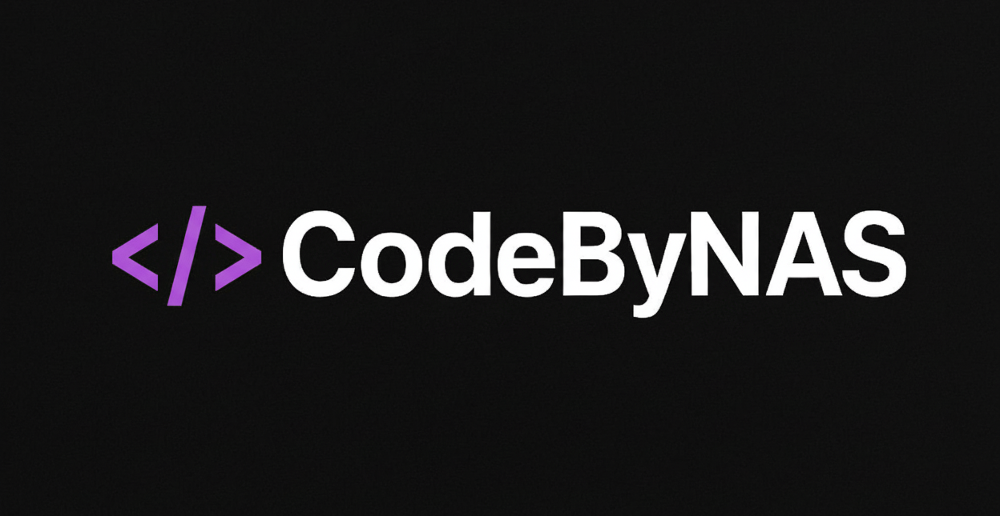
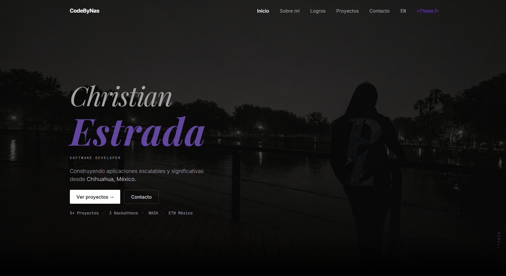

  

## Hi! I’m Christian Estrada, a passionate software developer from Chihuahua, Mexico

I enjoy creating meaningful and scalable applications using technologies like C#, C++, React, and Node.js. I’m currently expanding my skills in Web3 and cloud environments such as AWS

I’ve participated in hackathons with NASA, MIT, AWS, and ETH Mty, where I’ve learned to work in teams and build creative, real-world solutions

Always open to collaboration and new challenges that push my limits as a developer 

## Tech Stack

  

  

  

## Portfolio Preview

  

